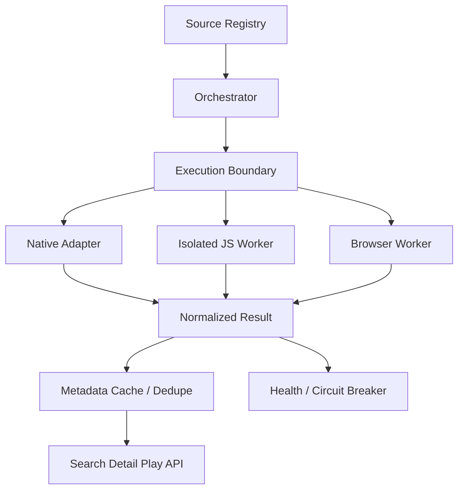

# 多源后端适配计划

## 目标

将 `remote_sources/source_urls.json` 中保存的 13 个源纳入同一个后端编排层。前端只面对统一 API，不关心源站是 JSON、HTML、AES、签名接口还是页面播放器。

后端不把远程 JS 当作可信服务器代码直接执行。每个源必须有明确的 manifest、域名白名单、超时、并发预算和运行时类型；只有已获授权的源才进入启用列表。

## 1. Lanerc 后端模式的可复用部分

APK 的后端思想可以抽象为四层：



- Registry：源键、名称、代码文件、Host、运行时、能力和状态。
- Orchestrator：有界并发 fan-out、超时、取消、去重、回退和排序。
- Execution Boundary：禁止源脚本访问文件系统、进程、内网和未授权域名。
- Normalized Result：统一 `Item / Detail / Episode / PlayResult / QualityOption`。
- Health：记录 P50/P95、错误类型、连续失败和熔断时间。

## 2. 全部源的适配矩阵

| 源键 | 本地 JS | 主要协议/鉴权 | 播放链路 | 推荐运行时 | 首期状态 |
| --- | --- | --- | --- | --- | --- |
| `lanerc` | `lanerc.js` | JSON API；配置中的签名/认证 | `app/proxyx3x` 返回 `play_url` | Native | 已有适配器 |
| `AuvFun` | `AuvFun.js` | AES-128-ECB 响应；MD5 sign；固定 deviceId/UA | `/episode/jx` 返回 `resolutionList` | Native | 可迁移 |
| `cycapp` | `cycapp.js` | JSON API；PC UA/Referer | `play_url`，必要时二次 GET `json.url` | Native | 可迁移 |
| `jinpai` | `jinpai.js` | GET + SHA1/MD5 sign；多 Host | `/video/episode/url` 返回多清晰度 | Native | 可迁移 |
| `sanqiu` | `sanqiu.js` | GET + `x-sign` SHA-256 | `/decode/url` 返回带签名 m3u8 | Native | 可迁移 |
| `yzx` | `yzx.js` | AES-256-GCM 详情；`vuk=md5(id+key)` | `video/playurl` 返回直链 | JS Worker 或 Native | 需密钥轮换处理 |
| `gugu` | `gugu.js` | 表单 JSON + AES-CBC/PKCS7 | parse_api / `vodParse` 多级解析 | JS Worker | 需隔离 |
| `shuangxing` | `shuangxing.js` | AES-256-CBC + zlib + SHA-256；会话初始化 | `/app/vodParser` 或直链 | JS Worker | 需隔离 |
| `guazi` | `guazi.js` | 动态 token；RSA 封装 AES key；MD5 signature | `VurlDetail/showOne` 直链 m3u8 | JS Worker | 需隔离和密钥保护 |
| `dmbus` | `dmbus.js` | HTML 正则；hhjx 解密 POST | iframe → hhjx `/api.php`，失败时 sniff | Browser Worker | 需浏览器回退 |
| `akianime` | `akianime.js` | ds_api JSON；Cookie/Cloudflare | `player_aaaa`、外部 parser、sniff | Browser Worker | 需浏览器回退 |
| `lmm85` | `lmm85.js` | HTML；smart_verify；Cloudflare | `player_aaaa` 或 WebView sniff | Browser Worker | 需浏览器回退 |
| `xifanacg` | `xifanacg.js` | HTML/JSON；`player_aaaa` | watch 页面直出或 sniff | Browser Worker | 需浏览器回退 |

“可迁移”表示协议和加密边界清晰，适合改写为 TypeScript 原生 Adapter；不是表示当前已经在线启用。

## 3. 统一数据契约

```ts
type SourceItem = {
  sourceKey: string;
  id: string;
  title: string;
  year?: string;
  kind?: string;
  cover?: string;
  description?: string;
  sourceCount: number;
};

type Episode = {
  id: string;
  name: string;
  route: string;
  flag: Record<string, string>;
};

type QualityOption = {
  id: string;
  name: string;
  url: string;
  type: "m3u8" | "mp4" | "flv" | "auto";
  width?: number;
  height?: number;
  bitrate?: number;
};

type PlayResult = {
  url: string;
  type: QualityOption["type"];
  headers?: Record<string, string>;
  referer?: string;
  resolutions?: QualityOption[];
  expiresAt?: string;
};

interface SourceAdapter {
  search(query: string, page: number, signal: AbortSignal): Promise<SourceItem[]>;
  detail(id: string, signal: AbortSignal): Promise<{ item: SourceItem; episodes: Episode[] }>;
  play(flag: Episode["flag"], signal: AbortSignal): Promise<PlayResult>;
}
```

播放接口必须把 `resolutions` 作为源端清晰度返回；播放器内核、硬解、Anime4K、码率自适应属于客户端设置，不能与源端清晰度混在一个字段里。

## 4. 后端重要功能

### 4.1 源注册和版本化

每个源 manifest 至少包含：

```json
{
  "key": "example",
  "codeFile": "remote_sources/example.js",
  "runtime": "native|js-worker|browser-worker",
  "enabled": false,
  "allowedHosts": ["https://source.example"],
  "searchTimeoutMs": 8000,
  "playTimeoutMs": 15000,
  "maxConcurrency": 2,
  "cacheTtlSec": 60
}
```

manifest 的版本、校验哈希和启停状态进入数据库；JS 文件只作为审计输入，不在请求路径中从互联网动态下载。

### 4.2 有界并行与熔断

- 搜索每个请求最多并发 `N` 个源。
- 每源独立连接/读取超时，禁止无限重试。
- 连续失败进入 open 状态，冷却后半开探测。
- 失败源返回状态，不把整个请求变成 500。
- 多实例部署时健康状态放 Redis；单实例内存状态只能用于开发。

### 4.3 缓存策略

- 搜索/详情：短 TTL + stale-while-revalidate，只缓存结构化元数据。
- 播放 URL、签名和 Cookie：仅内存短缓存，按过期时间清理，不写长期数据库。
- 图片：默认让客户端直连来源；若获授权可使用独立图片 CDN。
- 不缓存 m3u8、TS、m4s、MP4 等媒体字节。

### 4.4 JS Worker

对 `gugu/guazi/shuangxing/yzx` 等源，使用 QuickJS Worker 池而不是 Node `eval`：

- 每个任务使用独立 context 和 generation；源切换后丢弃旧结果。
- Bridge 只暴露 `request/get/post/parseJson/crypto/log` 等最小能力。
- `request` 先检查 URL 是否命中 manifest 的 `allowedHosts`。
- 限制 CPU 时间、响应体大小、递归深度和并发数。
- 不暴露 `fs`、`child_process`、网络 socket、环境变量和服务端密钥。

### 4.5 Browser Worker

`dmbus/akianime/lmm85/xifanacg` 的 sniff/Cloudflare 路径不能在普通 fetch 中假设可用。浏览器 Worker 只在原生直连失败时启用，并且：

- 使用独立浏览器上下文和一次性 Cookie 容器。
- 只允许访问源站白名单。
- 页面加载、脚本执行、截图和网络响应都有上限。
- 不把挑战 Cookie 返回给客户端或写入日志。
- 如果来源不允许程序化访问，直接标记源不可用，不尝试绕过挑战。

## 5. 分阶段实施

### Phase 1：注册表和契约

- 用全部 13 个本地 JS 建立 manifest。
- 完善 `SourceAdapter`、标准化模型、错误码和源健康模型。
- 当前默认全部 `enabled=false`，只保留 Lanerc 作为已配置示例。

### Phase 2：Native Adapters

按风险从低到高迁移 `cycapp → jinpai → sanqiu → AuvFun → lanerc`，每个源配录制的 mock 响应测试，不在测试中调用第三方真实地址。

### Phase 3：JS Worker Adapters

接入 QuickJS Worker，优先迁移 `yzx`，再处理 `gugu/guazi/shuangxing` 的加密和会话状态。每个 Worker 都要有 bridge 合约测试和资源上限测试。

### Phase 4：Browser Workers

最后处理 `dmbus/akianime/lmm85/xifanacg`。没有稳定、授权的浏览器访问条件时，这些源保持 disabled，而不是用不稳定的公开代理硬撑。

### Phase 5：生产高并发

- Redis：限流、缓存、熔断和请求去重。
- Prometheus/OpenTelemetry：按源统计耗时、成功率、播放失败率。
- 队列：异步健康探测和 manifest 校验。
- 网关：请求大小、速率、SSRF、Origin/Referer 白名单。

## 6. 验收门槛

每个源完成以下项目才能启用：

1. `search/detail/play` 三个契约测试通过。
2. 至少一个成功响应和四类失败响应（超时、非 JSON、空结果、上游 5xx）有测试。
3. 播放结果能区分直链、HLS、多清晰度和需要浏览器的情况。
4. 所有请求域名命中白名单，日志不出现 Cookie、签名和完整 token。
5. 源下线或失效时不会影响其他源，也不会覆盖新一代请求结果。

## 当前判断

“所有 JS 地址都适配”不应等价于“所有源都在一个 Next.js 请求里直接执行”。正确的完成定义是：13 个源都有 manifest 和统一契约；能原生迁移的用 Native Adapter；依赖 QuickJS 的进入隔离 Worker；依赖 Cloudflare/页面嗅探的进入受控 Browser Worker；未获授权或无法稳定访问的源保持禁用并给出可观测状态。
