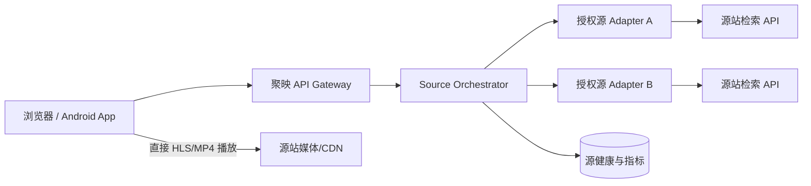

# Lanerc 架构评审与聚映演进方案

> 评审依据：已连接设备中的 `com.qsreod` APK（versionName 1.0.6）、反编译源码、已保存的远程 JS 源，以及当前 `lanerc-platform` 原型。
>
> 这份文档描述“如何做授权的多源检索与直播放”。不包含绕过 DRM、伪造授权、隐藏来源或把第三方视频落盘的方案。

## 1. 结论先行

Lanerc 不是一个把所有视频集中转码后再分发的中心化视频站。它更接近“客户端源编排器”:

1. 启动时拉取一个远程源目录。
2. 每个源对应一段实现统一函数的 JS：`search`、`detail`、`play`，部分源还有 `homeSections`/`config`。
3. QuickJS 在客户端执行 JS；JS 通过受控桥接调用 HTTP、Cookie、加密和 JSON 能力。
4. 搜索时并行请求多个源，统一字段、去重、按源健康情况切换。
5. 播放时拿到源端返回的 HLS/MP4 地址，交给 Media3/ExoPlayer 或 MPV；只有在播放兼容性需要时，才使用设备内的本地 HLS 重写服务。

因此，聚映的正确演进方向是：



媒体字节默认不经过聚映服务器，服务器只负责检索、详情和短时播放授权信息。这样既符合“不存储影片”的目标，也避免服务器变成带宽瓶颈。

## 2. Lanerc 的实际模块

### 2.1 源目录与源代码

- `C1465IooIOOOOOOO`：远程配置单例和初始化入口。
- `C0933IOOoOOOOOOO`：合并远程源和用户自定义源，持久化 `user_sources`、`active_source`。
- `C1515lIoIOOOOOOO`：源配置模型，包含 `key/title/desc/codeUrl/code/enabled`。
- `C0960llOOOOOOOOO`：源代码缓存和更新器，代码落在应用私有目录 `filesDir/jssrc`，约十分钟检查一次。
- 远程配置使用 AES-GCM；JS 代码使用 `ENC1` + AES-CBC。它们是“传输/缓存保护”，不是服务器端可以直接复用的安全边界。

### 2.2 JS 执行器

`C0966looOOOOOOOO.java` 使用单线程 QuickJS 执行器，每次调用有超时，并通过 generation 号丢弃源切换后的旧结果。JS 桥包含：

- `request/get/post`、重定向、Cookie、UA；
- md5/sha/aes/des/rsa 等密码辅助；
- `sniffMedia`、`sniffAll`；
- 本地键值、JSON 和日志。

这解释了它为什么可以用多段很小的源脚本接入不同站点。但这套桥权限很高，网站后端不能直接 `eval` 任意远程 JS；生产实现必须给每个源配置域名白名单、超时、资源配额和隔离执行环境。

### 2.3 统一源合约

源脚本并非各自返回任意页面，而是被归一到共同的调用面：

```text
categories()?
search(keyword, page)
detail(id)
play(flag)
homeSections()?
config()?
```

`remote_sources/lanerc.js` 的链路是：发现可用 Host → `app/vod/search` → `app/getvod/{id}` → 读取配置中的签名/认证 → `app/proxyx3x` → 返回 `play_url`。这里的 `flag` 是“源站播放路由标识”，不是一个可以跨站复用的通用播放地址。

## 3. 播放、HLS 和清晰度

### 3.0 首页为什么能显示视频

首页卡片和播放地址是两条不同链路。Lanerc 的 `homeSections()` 会请求源端 `app/home`，将返回的 `banner`、`hot_list`、`vod_list` 转换成卡片数据；卡片只包含 ID、标题、年份、封面和简介，不包含最终 m3u8/MP4 播放地址。用户打开详情、选择剧集后，才会调用 `play()` 获取临时播放地址。

APK 端对首页有两层缓存：JS 运行时中的 `_lanercHome` 只避免同一运行时重复请求；`C1536loIIOOOOOOO` 又以 `homeSections|源键|应用版本` 作为键，把结构化首页列表序列化到应用 cache，默认约 3 天过期。图片由 Coil/图片加载器按 URL 单独缓存，封面请求可携带 Referer/UA；这些缓存不等于影片或播放流存储。

因此聚映的首页实现应使用 `GET /api/home` 获取结构化分区，短 TTL 缓存卡片元数据，封面默认直连来源；不要在首页预解析播放地址，也不要把首页请求变成媒体代理。

### 3.1 播放数据流

1. 搜索结果只携带标题、年份、源键和详情 ID。
2. 打开详情后，源返回剧集和播放路由。
3. 用户选中剧集，服务端调用源的 `play` 合约。
4. 只返回 `url/type/referer/headers/qualityOptions` 等播放元数据。
5. 客户端播放器连接源站 CDN，媒体分片不进入聚映数据库。

### 3.2 Lanerc 的本地 HLS 服务

`C0798oOoOOOOOOOO` 会在 `127.0.0.1` 随机端口启动本地服务，维护短期 URL 映射：

- `/media/*`：登记带请求头、Cookie、Referer 的媒体请求；
- `/seg/*`：按登记信息拉取分片并转发；
- playlist 内容可以被改写为本地地址；
- 映射表有数量上限，使用 UUID/时间戳键，不是影片库。

它主要解决“播放器无法为跨域 HLS 分片附带源站请求头”的设备内兼容问题。网站端不要照搬为公开反向代理：公开媒体代理会吞掉带宽、放大 SSRF 和盗链风险。只有在明确授权且有域名白名单时，才允许短时 manifest/segment relay。

### 3.3 “清晰度”的三层含义

APK 中同时存在三个不同概念：

| 层 | 证据 | 作用 |
| --- | --- | --- |
| 源端清晰度 | `play` 返回的 `resolutions`，以及 HLS/DASH manifest 中的多条 representation | 真正改变下载码率/分辨率 |
| Media3 轨道选择 | `TrackSelectionDialogBuilder`、`DefaultTrackSelector` | 在 manifest 已提供的音视频轨道中选择或自适应 |
| MPV/Anime4K 后处理 | `mpvHwdec`、`mpvProfile`、Anime4K mode/quality | 解码、渲染和放大质量，不会凭空增加源视频细节 |

所以聚映的播放器 API 应返回结构化的 `qualityOptions`；客户端优先选择源端 representation，再把 `engineProfile`/`upscale` 当作独立设置。不能把 Anime4K 标签冒充“4K 片源”。

## 4. 并发、失败和高并发边界

### 4.1 APK 内的并发模型

- QuickJS 代码执行本身是单线程、可取消、有超时的。
- HTTP 请求由 OkHttp/协程执行；源切换会取消当前工作并使旧 generation 失效。
- 设置模型明确暴露 `searchThreads`、`downloadConcurrent`、`downloadSegments`。
- 源不可用时会记录失败并自动尝试其他源。

这说明 Lanerc 的“多源并行”主要发生在每台设备上，而不是一个中心服务器同时替所有用户代理视频。视频流量通常由源站/CDN 承担。

### 4.2 聚映服务端必须补上的保护

当前原型只有一个 Lanerc HTTP 适配器和演示源，不能直接宣称已经具备 Lanerc 的高并发能力。生产版需要：

1. 有界 fan-out：每个搜索请求只允许固定数量的并行源调用。
2. 每源独立超时、重试预算和熔断；一个坏源不能拖慢全部结果。
3. 结果去重使用规范化标题、年份和源 ID，不把不同版本误合并。
4. 元数据采用短 TTL/SWR 缓存；播放 token 和 URL 不写入长期缓存。
5. Redis/数据库记录源健康、延迟、错误率和熔断状态；不能依赖单实例内存。
6. 令牌桶限流、请求体大小限制、SSRF 域名白名单和日志脱敏。
7. 播放接口只返回短时、授权的直链/播放元数据，默认不代理媒体字节。

## 5. 当前原型的缺口

| 项目 | 当前状态 | 下一步 |
| --- | --- | --- |
| UI/PWA | 已有检索、详情、播放器弹层和安装清单 | 保留，补真实质量菜单 |
| 源注册 | 路由内写死 12 个源，只有 Lanerc 适配器实际调用 | 抽成 `SourceAdapter` 和注册表 |
| 多源并行 | 目前只有单源调用 | 引入有界 fan-out，并返回逐源耗时/状态 |
| 播放 | 返回直链，不存媒体 | 增加 `qualityOptions`、headers/referer 的安全白名单 |
| 高并发 | 无分布式健康/熔断 | 先实现请求级边界，部署时接 Redis/监控 |
| Android | 现在是 PWA，不是原生 APK | 第二阶段用 Media3；MPV 作为可选内核 |
| 远程 JS | 已保存用于分析，但服务端不执行任意远程 JS | 生产仅接入审计过的适配器，必要时隔离 worker |

## 6. 推荐落地顺序

### 阶段 A：可验证的检索 MVP

- `SourceAdapter` 接口：`search/detail/play`。
- 仅接入已获授权、域名固定的源；每源有 manifest 和健康状态。
- 有界并行、超时、去重、SWR 元数据缓存。
- Play API 输出直链和质量元数据，前端展示源、清晰度、码率/分辨率。

### 阶段 B：播放器与 Android

- Web：原生 HLS 支持时使用 `<video>`，否则使用 hls.js 类客户端适配层。
- Android：Media3/ExoPlayer 作为默认内核，TrackSelector 实现清晰度菜单；MPV 作为兼容性和后处理选项。
- 加入倍速、自动连播、画中画、全屏、断点和“切换源”。

### 阶段 C：运营和高并发

- Redis：源健康、短 TTL 结果缓存、请求去重。
- Prometheus/OpenTelemetry：按源统计 P50/P95、成功率、熔断次数和播放失败原因。
- 网关限流、队列化后台健康探测、灰度启用新源。
- 只有明确授权的 manifest/segment relay 才单独部署，并设置最大响应大小和生命周期。

## 7. 验收标准

- 搜索：单个源超时不影响其他源返回；响应带逐源状态。
- 详情：同一影片的多源结果可展开，而不是重复卡片。
- 播放：优先直连 CDN；不会把分片写入数据库或对象存储。
- 清晰度：能区分源端 1080p/720p 与播放器后处理；无可选轨道时明确显示“源仅提供单一画质”。
- 稳定性：源切换后旧请求不会覆盖新结果；超时和熔断可观测。
- 安全：远程 JS 不具备任意文件/进程/内网访问能力；日志中不出现签名、Cookie 和完整播放 token。
