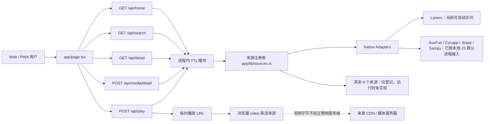

# 聚映当前系统架构

> 文档状态：2026-07-23（来源变体与移动端播放器核心已落地）  
> 适用提交：当前工作区最新提交  
> 本文只描述已经存在的能力；规划中的能力见 `docs/product-gap-roadmap.md`。

## 1. 系统定位

聚映当前是一个“多来源元数据检索 + 来源方临时播放入口”的 Web/PWA 原型。

当前系统会：

- 从已经实现并启用的来源 Adapter 获取首页、检索、详情和剧集数据。
- 在用户选择某一集时，向来源方请求临时播放地址。
- 将播放地址交给浏览器 `<video>` 元素直连播放。
- 在服务进程内短时缓存元数据和临时播放结果。
- 在用户设备的 `localStorage` 保存收藏、最近打开记录、播放进度和倍速偏好。

当前系统不会：

- 在服务端保存视频文件、切片或完整媒体流。
- 将来源方远程 JS 直接放进 API 请求进程执行。
- 自动绕过来源方鉴权、会员、付费、地区或防盗链限制。
- 持久化完整影片目录、榜单、排期或弹幕；播放进度目前只保存在设备端。

## 2. 技术栈和运行形态

| 层 | 当前实现 |
|---|---|
| Web 框架 | Next.js 16 App Router 接口，由 vinext 构建 |
| UI | React 19、`app/page.tsx` + `app/components/player/MediaPlayer.tsx`、Lucide 图标 |
| 样式 | `app/globals.css`，桌面深色影院布局 + 移动端浅色 App 布局 |
| API | `/api/home`、`/api/search`、`/api/detail`、`/api/media/detail`、`/api/play` |
| 来源适配 | TypeScript Native Adapter；JS Worker/Browser Worker 仅登记未实现 |
| 缓存 | Node/Worker 进程内 `Map`，带 TTL 和 singleflight 请求合并 |
| 数据库 | 未启用；`db/schema.ts` 当前为空 |
| 用户数据 | 浏览器 `localStorage`，无登录、无云同步 |
| App 形态 | PWA；Manifest + Service Worker，不是原生 APK |
| 部署 | Cloudflare Worker 兼容的 vinext 构建，通过 Sites 发布 |

## 3. 当前请求链路

## 4. 目录和模块职责

### 4.1 前端

| 文件 | 职责 | 当前限制 |
|---|---|---|
| `app/page.tsx` | 首页、搜索、片库、详情、播放器入口、个人页、收藏和历史 | 页面状态仍较集中，后续继续拆分目录/详情领域组件 |
| `app/components/player/MediaPlayer.tsx` | 自定义移动端播放器、剧集/来源/倍速/弹幕设置面板、进度记录 | 弹幕数据通道和设备缓存尚未接入 |
| `app/components/player/types.ts` | 播放会话、作品、剧集、清晰度契约 | 仍是前端契约，未持久化到数据库 |
| `app/globals.css` | 桌面与移动端响应式样式及播放器控制层 | 横屏手势和锁屏还未实现 |
| `app/layout.tsx` | 页面元数据、Manifest 入口 | 无 Open Graph 专用图片 |
| `public/manifest.webmanifest` | PWA 名称、主题色、启动地址和图标 | 尚未生成 Android 原生安装包 |
| `public/sw.js` | 缓存同源脚本、样式和页面壳 | 不缓存 API、封面、播放地址或视频 |

### 4.2 API

| 路由 | 输入 | 输出 | 超时 | 缓存 |
|---|---|---|---:|---:|
| `GET /api/home` | 可选 `source` | 来源首页分区 | 每源 12 秒 | 15 分钟 |
| `GET /api/search?q=` | 搜索词 | 去重后的结果和来源状态 | 每源 10 秒 | 5 分钟 |
| `GET /api/detail?source=&id=` | 来源和来源内 ID | 详情与剧集 | 12 秒 | 30 分钟 |
| `POST /api/media/detail` | `variants[]`（来源键和来源内 ID） | 规范作品、多来源变体、合并剧集和线路 | 每源 12 秒 | 30 分钟 |
| `POST /api/play?source=` | 剧集 `flag` | 临时 URL、类型、清晰度列表 | 18 秒 | 15 秒 |

### 4.3 后端基础设施

| 文件 | 职责 |
|---|---|
| `app/lib/sources.ts` | 13 个来源的注册表、运行时类型和 Adapter 映射 |
| `app/lib/adapters/types.ts` | `SourceItem`、`Episode`、`PlayResult` 和 Adapter 合约 |
| `app/lib/adapters/native.ts` | Lanerc、AuvFun、Cycapp、Jinpai、Sanqiu 的 Native Adapter |
| `app/lib/catalog.ts` | 规范作品 ID、来源变体保留、详情剧集合并 |
| `app/lib/fanout.ts` | 搜索来源的有界并发执行和耗时统计 |
| `app/lib/cache.ts` | TTL 缓存和相同请求 singleflight 合并 |
| `config/source-manifests.json` | 原始来源脚本、运行时和已知主机清单 |
| `worker/index.ts` | Cloudflare Worker/vinext 入口和图像优化 |

## 5. 来源适配现状

“登记为 enabled”不等于“当前能返回资源”。必须同时满足：已有运行时、已有 Adapter、来源配置可用、来源接口仍可访问。

| 来源 | 注册运行时 | 当前代码状态 | 当前环境状态 | 首页/搜索/详情/播放 |
|---|---|---|---|---|
| Lanerc | native | 已按完整 JS 契约实现 | 可自动发现并访问 | 已实测贯通 |
| AuvFun | native | 已按本地 JS 的首页/搜索/详情/播放流程实现 | 使用 JS 内置默认值，可用环境变量覆盖 | 首页/搜索已实测，播放依来源状态 |
| 次元城 Cycapp | native | 已按本地 JS 的分类/搜索/详情/播放流程实现 | 默认主机来自 JS；当前接口返回 401 | 等待来源接口恢复/授权 |
| 金牌 Jinpai | native | 已按本地 JS 的多域名/签名/清晰度流程实现 | 使用 JS 内置默认值，可用环境变量覆盖 | 需继续健康验证 |
| 三秋 Sanqiu | native | 已按本地 JS 的筛选/搜索/详情/解码流程实现 | 使用 JS 内置默认值，可用环境变量覆盖 | 首页/搜索已实测 |
| 瓜子 | js-worker | 仅登记 | JS Worker 未实现 | 不执行 |
| 双星 | js-worker | 仅登记 | JS Worker 未实现 | 不执行 |
| 云帆 | js-worker | 仅登记 | JS Worker 未实现 | 不执行 |
| 咕咕动漫 | js-worker | 仅登记 | JS Worker 未实现 | 不执行 |
| 稀饭动漫 | browser-worker | 仅登记 | Browser Worker 未实现 | 不执行 |
| AkiAnime | browser-worker | 仅登记 | Browser Worker 未实现 | 不执行 |
| 动漫在线 | browser-worker | 仅登记 | Browser Worker 未实现 | 不执行 |
| 动漫巴士 | browser-worker | 仅登记 | Browser Worker 未实现 | 不执行 |

因此，当前“资源少”的根因是：

1. 之前只有 Lanerc 被执行；本轮已将 AuvFun 和 Sanqiu 的本地 JS 默认流程接入，首页资源量已增加。
2. 首页只展示来源首页接口主动返回的有限分区，并不是全站目录。
3. 搜索是按关键词临时调用来源，不存在预先同步的完整目录库。
4. 规范作品已经保留同一作品的 `variants[]`，但目前只在请求生命周期内聚合，尚未落到持久目录。
5. JS Worker 和 Browser Worker 尚未落地，八个登记来源仍不会被执行。

## 6. 当前数据模型

### 6.1 `SourceItem` 与 `SourceVariant`

当前作品模型只有：

- 来源内 ID
- 标题
- 年份
- 类型文本
- 封面
- 简介
- 来源数量

搜索和详情聚合现在会额外返回：

- `id`：聚映进程内稳定的规范作品 ID（由标题和年份确定性生成）
- `sourceKey/sourceTitle`
- `variants[]`：每个来源的来源内 ID、标题、封面和简介
- `sourceCount`：当前请求中成功聚合的来源数量

仍缺少：

- 聚映自己的稳定作品 ID
- 别名、原名、地区、语言、季度
- 作品状态、总集数、更新时间
- 演职员、制作公司、标签数组
- 规范化评分和热度
- 排期和更新时间

### 6.2 `Episode` 与 `CanonicalEpisode`

当前剧集只包含：

- 来源内剧集 ID
- 剧集名称
- 路线名称
- 交给 Adapter 的不透明 `flag`

`POST /api/media/detail` 会把多个来源中相同集号/集名的剧集合并为：

- `id/name/number`
- `sources[]`：来源键、来源内作品 ID、路线名和 `flag`

缺少规范化集号、季度、发布时间、时长、多来源映射、播放进度和下一集关系。

### 6.3 `PlayResult`

当前播放结果支持：

- URL
- `m3u8` / `mp4` / `flv` / `auto`
- 请求头和 Referer
- 可选清晰度列表
- 可选过期时间

但前端只消费 URL、类型和清晰度列表。额外请求头无法直接交给浏览器原生 `<video>`，需要授权的播放代理或原生播放器网络层才能可靠处理。

## 7. 搜索和多源合并逻辑

`/api/search` 当前流程：

1. 选择 `enabled && adapter` 的来源。
2. 默认最多并发 4 个来源。
3. 每个来源最多等待 10 秒。
4. 将结果按规范化标题 + 年份聚合。
5. 保留每个来源的 `variants[]`，并计算 `sourceCount`。
6. 详情页把 `variants[]` 发给 `/api/media/detail`，并行拉取各来源剧集。

仍存在的缺陷：

- 标题和年份不足以稳定识别同一作品，特别篇、剧场版、季度和别名容易误合并或漏合并。
- 当前环境只有 Lanerc 返回真实数据，因此大多数作品仍只有一个变体。
- 没有分页聚合游标。
- 没有搜索结果排序、相关度评分、来源健康权重。

## 8. 首页、分类、榜单和排期

当前首页直接使用来源方返回的分区名称，例如“轮播”“热门”“日漫”“剧场版”。

当前没有独立实现：

- 日漫 TV、剧场版、国漫、欧美、短剧等统一一级分类。
- 按题材、地区、年份、季度、状态、评分筛选。
- 热度排行榜的统一计算。
- 周一到周日的番剧更新时间表。
- 完结、新番、连载、最近更新列表。
- 后台目录同步和分类索引。

页面上的“日漫”和“剧场版”按钮目前只是对已加载数据做文本筛选，不是完整分类 API。

## 9. 播放器现状

播放器当前由 `app/components/player/MediaPlayer.tsx` 和 `app/page.tsx` 的会话解析组成，已支持：

- 标题和当前路线。
- 自定义播放/暂停、进度条、上一集/下一集和连播到下一集。
- 播放器内选集、来源切换、倍速菜单、画中画、全屏和分享。
- 收藏、播放进度（约 12 秒写入）、倍速偏好和真实空弹幕状态。
- 媒体类型提示。
- 来源直连提示。
- Adapter 返回多清晰度时的清晰度按钮。

尚未实现：

- 弹幕加载、发送、屏蔽和弹幕设置。
- 横竖屏切换、锁屏、手势调节亮度/音量/进度。
- 清晰度切换时的真实 URL 重解析和进度保持。
- 缓存任务、下载状态和授权判断。

说明：

- 弹幕设置面板已经存在，但当前没有接入授权弹幕数据源，因此会显示“暂无弹幕通道”。
- “缓存”入口明确标记为未启用，不会伪装成下载成功。
- 历史记录仍在打开详情时写入；播放进度另由播放器写入 `juying:progress:${mediaId}`，尚未与历史记录统一。

## 10. 收藏、历史和用户数据

当前收藏和历史位于：

- `juying:favorites`
- `juying:history`

存储位置为当前浏览器 `localStorage`，最多保留 40 条。

限制：

- 清理浏览器数据后会丢失。
- 不同设备不同步。
- 播放进度已经按作品/集数写入 `juying:progress:${mediaId}`，但还没有与历史列表统一。
- 没有服务端账号同步。
- 没有收藏夹分组、追番更新提醒或账号系统。
- 没有数据导出/恢复实现。

## 11. 缓存和并发

### 11.1 已实现

- TTL 过期控制。
- 相同 Key 的并发请求复用同一个 Promise。
- 搜索来源最大并发数默认 4，可用 `SEARCH_SOURCE_CONCURRENCY` 调整。
- 单来源调用有 AbortSignal 超时。

### 11.2 当前边界

- 缓存只存在于单个热进程/Worker isolate。
- 冷启动、扩容和实例切换后缓存不共享。
- 没有 Redis/KV/D1 持久目录缓存。
- 首页来源当前按顺序执行，不是有界并行。
- 没有熔断、退避重试、来源健康分、限流或请求队列。
- 没有后台预热和增量目录同步。

## 12. 存储边界

| 数据 | 当前是否存储 | 位置 |
|---|---|---|
| 视频文件/切片 | 否 | 不经过服务端 |
| 临时播放 URL | 是，15 秒 | 进程内内存 |
| 首页元数据 | 是，15 分钟 | 进程内内存 |
| 搜索元数据 | 是，5 分钟 | 进程内内存 |
| 详情/剧集 | 是，30 分钟 | 进程内内存 |
| 封面 | 否 | 浏览器直接请求来源 URL |
| 收藏/历史 | 是 | 用户浏览器 localStorage |
| 完整目录/榜单/排期 | 否 | 尚未建设 |

## 13. 配置和安全边界

当前不会使用通用的：

- `LANERC_DISCOVERY_URL`
- `LANERC_FALLBACK_URL`
- `LANERC_ALLOWED_HOSTS`

来源专用环境变量现在是“可选覆盖”，不是所有来源的必填项。AuvFun、Jinpai、Sanqiu 的默认主机/签名参数来自已审核的本地 JS；Cycapp 的默认主机也来自本地 JS。可覆盖项包括：

- `AUVFUN_BASE_URL`
- `AUVFUN_API_SECRET`
- `AUVFUN_AES_KEY`
- `AUVFUN_DEVICE_ID`
- `CYCAPP_BASE_URL`
- `JINPAI_BASE_URL`
- `JINPAI_KEY`
- `SANQIU_BASE_URL`
- `SANQIU_SIGN_FINGER`

原始来源脚本位置：

- `C:\Users\songz\Desktop\public-work\remote_sources\*.js`
- 这些脚本是 Adapter 的行为依据，但不会在 API 主进程直接执行；Native Adapter 采用逐方法移植，JS/Browser 来源后续进入隔离运行时。

安全原则：

- 密钥只能放在服务端环境变量，不能进入前端包、日志或文档示例值。
- 未审计远程 JS 不能在 API 主进程执行。
- Browser Worker 必须与主服务隔离，限制网络、时间、内存和返回数据大小。
- 只接入拥有授权或明确允许聚合/播放的来源。
- 不通过代理设计绕过会员、付费、防盗链或访问控制。

## 14. 当前测试和可观测性

已有测试覆盖：

- 首页服务端能渲染。
- 搜索接口返回规范化来源状态。
- 首页接口返回来源边界且不获取媒体。

缺少：

- Adapter 契约测试和固定响应样本。
- 多源去重、换源、分页和错误降级测试。
- 播放器交互和移动端端到端测试。
- 缓存命中、singleflight、超时和熔断测试。
- 真实来源健康监控、延迟、错误率和播放成功率指标。

## 15. 当前最重要的技术债

1. `app/page.tsx` 是大组件，应拆成领域组件和 Hooks。
2. 规范作品和来源变体目前只在请求生命周期内存在，尚无持久目录。
3. 没有统一目录和分类索引，因此榜单、排期、筛选都无法可靠实现。
4. 自定义播放器核心已落地，但弹幕、手势、清晰度重解析和缓存仍未闭环。
5. 八个 JS/Browser 来源尚无安全运行时。
6. 数据库为空，没有持久化元数据、进度和来源健康。
7. `config/source-manifests.json` 的部分 `adapterStatus` 与代码现状不同，需要在适配器验收后统一维护。
