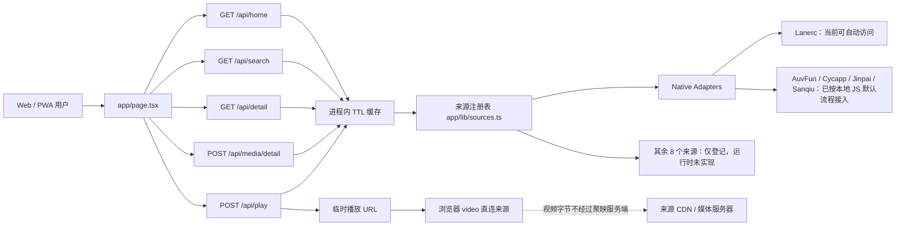

# 聚映当前系统架构

> 文档状态：2026-08-01（Android Anime4K、稳定分类榜、阿里云账号同步与公告）
> 适用提交：当前工作区最新提交  
> 本文只描述已经存在的能力；规划中的能力见 `docs/product-gap-roadmap.md`。

## 1. 系统定位

聚映当前是一个“多来源元数据检索 + 来源方临时播放入口”的 Web/PWA 原型。

当前系统会：

- 从已经实现并启用的来源 Adapter 获取首页、检索、详情和剧集数据。
- 在用户选择某一集时，向来源方请求临时播放地址。
- 将播放地址交给浏览器 `<video>` 元素直连播放。
- 在服务进程内短时缓存元数据和临时播放结果。
- 在用户设备的 `localStorage` 保存收藏、最近打开记录、播放进度和倍速偏好。

当前系统不会：

- 在服务端保存视频文件、切片或完整媒体流。
- 将来源方远程 JS 直接放进 API 请求进程执行。
- 自动绕过来源方鉴权、会员、付费、地区或防盗链限制。
- 持久化完整影片目录、榜单、排期或弹幕；播放进度目前只保存在设备端。

## 2. 技术栈和运行形态

### 2.1 Android 播放与发现补充

- 动漫分类排行榜使用“完整请求一次提交”的分类快照：进入分类后不再随首页来源分批返回而重排，只有右上角主动刷新会重新拉取。14 个 JS 源负责候选与播放，`AnimeMetadataRepository` 仅对标题精确/近精确匹配的动漫补真实评分、地区和 TV/剧场版元数据；它不参与播放，失败也不会影响视频解析。禁止生成假评分，无法验证地域或内容形态的条目不会强行入榜。
- Android 账号可选登录；阿里云 RDS 保存账号、会话、追番、进度、评论及设备缓存索引，DirectMail 发送验证码，OSS 只保存头像、公告与经过审核的来源脚本。任何视频文件、切片、本地路径及临时播放 URL 都不会进入云端账号同步。
- 当前初期生产账号主链路已切换为 Cloudflare Worker `api.songxiang.online` + D1；D1 保存账号、会话、验证码、追番、进度、评论、设备缓存索引和建议反馈，阿里云 DirectMail 继续发信，阿里云 OSS 继续只保存头像。Android 默认构建直接指向该自定义 API 域名。
- Android 个人页与设置页已连接真实账号状态：头像点击上传 OSS，昵称作为页首名称；修改密码使用原密码校验，修改邮箱使用新邮箱验证码。评论只在 D1 写入成功后上屏，发布失败保留草稿。
- 公告由 `aliyun-api` 读取 OSS `config/announcement.json`，Android 启动弹窗和首页公告条复用同一内容；用户的免打扰截止时间只保存在设备端。
- 更新检查并行比较多份 `update.json` 的版本与修订号，同版本优先发布者配置 URL；来源 JS 则优先从 `LANERC_SOURCE_SCRIPT_BASE_URL` 下载并保留旧 CDN、APK 资产回退。

- Android 继续以 Media3/ExoPlayer 作为唯一播放状态机；Anime4K 风格 GLSL 通过 `media3-effect` 本地 GPU 帧处理接入，不额外引入 Flutter `media_kit` 或第二套 libmpv 播放器，因此离线播放、画中画、换源和生命周期恢复仍共享同一状态。
- GPU 增强只处理视频渲染纹理，不改变播放 URL、请求头、解析缓存或来源选择。热切换采用停止帧流、设置效果、重新 prepare 并恢复进度；帧处理失败时关闭效果并恢复原流。
- 横向 Seek 预览使用 `MediaMetadataRetriever` 按目标时间提取缩放关键帧；提取任务限频、可取消并运行在 IO 调度器，手势结束后才提交最终 seek。
- Lanerc 发现数据由独立 `LanercDiscoveryRepository` 获取和缓存：`/app/home?class=20` 对应日漫 TV，`class=24` 对应国漫；排行榜只使用日漫TV与国漫两类，剧场版（原 `class=22`）已从排行榜移除。该缓存与 QuickJS、播放地址解析及播放器连接池隔离。
- 搜索画像只保存在本机：历史条目记录查询词、累计次数和最近搜索时间；推荐器将搜索相关度、观看记录、来源真实评分作确定性排序，不上传搜索记录，也不生成虚假热度。

| 层 | 当前实现 |
|---|---|
| Web 框架 | Next.js 16 App Router 接口，由 vinext 构建 |
| UI | React 19、`app/page.tsx` + `app/components/player/MediaPlayer.tsx`、Lucide 图标 |
| 样式 | `app/globals.css`，桌面深色影院布局 + 移动端浅色 App 布局 |
| API | `/api/home`、`/api/search`、`/api/detail`、`/api/media/detail`、`/api/play` |
| 来源适配 | TypeScript Native Adapter；JS Worker/Browser Worker 仅登记未实现 |
| 缓存 | Node/Worker 进程内 `Map`，带 TTL 和 singleflight 请求合并 |
| 数据库 | 未启用；`db/schema.ts` 当前为空 |
| 用户数据 | Web 保留 `localStorage`；Android 可选阿里云账号同步，本地模式继续可用 |
| App 形态 | PWA；Manifest + Service Worker，不是原生 APK |
| 部署 | Cloudflare Worker 兼容的 vinext 构建，通过 Sites 发布 |

## 3. 当前请求链路

## 4. 目录和模块职责

### 4.1 前端

| 文件 | 职责 | 当前限制 |
|---|---|---|
| `app/page.tsx` | 首页、搜索、片库专区与分类 Pills 筛选、详情、播放器入口、个人页、收藏和历史 | 支持实时分类筛选与更多专区展开 |
| `app/components/player/MediaPlayer.tsx` | 自定义移动端播放器、剧集/来源/倍速/弹幕设置面板、进度记录、safe-play 容错与换源引导 | 弹幕数据通道和设备缓存尚未接入 |
| `app/api/cover/route.ts` | 远程海报防盗链代理与默认 Header 伪装 | 支持自动修复 Mixed Content 与失败渐变占位 |
| `app/components/player/types.ts` | 播放会话、作品、剧集、清晰度契约 | 仍是前端契约，未持久化到数据库 |
| `app/globals.css` | 桌面与移动端响应式样式及播放器控制层 | 横屏手势和锁屏还未实现 |
| `app/layout.tsx` | 页面元数据、Manifest 入口 | 无 Open Graph 专用图片 |
| `public/manifest.webmanifest` | PWA 名称、主题色、启动地址和图标 | 尚未生成 Android 原生安装包 |
| `public/sw.js` | 缓存同源脚本、样式和页面壳 | 不缓存 API、封面、播放地址或视频 |

### 4.2 API

| 路由 | 输入 | 输出 | 超时 | 缓存 |
|---|---|---|---:|---:|
| `GET /api/home` | 可选 `source` | 来源首页分区 | 每源 12 秒 | 15 分钟 |
| `GET /api/search?q=` | 搜索词 | 去重后的结果和来源状态 | 每源 10 秒 | 5 分钟 |
| `GET /api/detail?source=&id=` | 来源和来源内 ID | 详情与剧集 | 12 秒 | 30 分钟 |
| `POST /api/media/detail` | `variants[]`（来源键和来源内 ID） | 规范作品、多来源变体、合并剧集和线路 | 每源 12 秒 | 30 分钟 |
| `POST /api/play?source=` | 剧集 `flag` | 临时 URL、类型、清晰度列表 | 18 秒 | 15 秒 |

### 4.3 后端基础设施

| 文件 | 职责 |
|---|---|
| `app/lib/sources.ts` | 13 个来源的注册表、运行时类型和 Adapter 映射 |
| `app/lib/adapters/types.ts` | `SourceItem`、`Episode`、`PlayResult` 和 Adapter 合约 |
| `app/lib/adapters/native.ts` | Lanerc、AuvFun、Cycapp、Jinpai、Sanqiu 的 Native Adapter |
| `app/lib/catalog.ts` | 规范作品 ID、来源变体保留、详情剧集合并 |
| `app/lib/fanout.ts` | 搜索来源的有界并发执行和耗时统计 |
| `app/lib/cache.ts` | TTL 缓存和相同请求 singleflight 合并 |
| `config/source-manifests.json` | 原始来源脚本、运行时和已知主机清单 |
| `worker/index.ts` | Cloudflare Worker/vinext 入口和图像优化 |

## 5. 来源适配现状

| 来源 | 运行时 | 状态 | 播放方式 | 说明 |
|---|---|---|---|---|
| Lanerc | native | ✅ search/detail/play | 浏览器直连 | douyinvod CDN |
| AuvFun | native | ✅ search/detail/play | 浏览器直连 | quark CDN auth_key |
| 次元城 Cycapp | native | ✅ search/detail/play | 代理 | UA 已修复 |
| 金牌 Jinpai | native | ✅ search/detail/play | 浏览器直连 | 6 域名轮换容灾 |
| 三秋 Sanqiu | native | ✅ search/detail/play | 浏览器直连 | play 偶发需切换 |
| 瓜子 Guazi | native | ✅ search/detail/play | 代理 | RSA+AES 加密协议 |
| 双星 Shuangxing | native | ✅ search/detail/play | 代理 | play 含三级容错：parser 失败回退原始 URL |
| 稀饭动漫 Xifanacg | native | ✅ search/detail/play | 代理 | WoCloud/Moedot CDN |
| 咕咕动漫 Gugu | native | ✅ search/detail/play | 代理 | AES-CBC 加密 API |
| 云帆 YZX | native | ❌ 已禁用 | — | 源站返回假流（JPG 占位） |
| AkiAnime | native | ❌ 已禁用 | — | DNS 封锁（198.18.0.57） |
| 动漫在线 Lmm85 | native | ❌ 已禁用 | — | Cloudflare 403 挑战 |
| 动漫巴士 Dmbus | native | ❌ 已禁用 | — | 全部域名 522 离线 |

### 播放链路

- **代理模式**（6源）：`浏览器 → /api/play → /api/proxy/stream → CDN`，代理发送完整浏览器指纹头
- **直连模式**（4源）：`浏览器 → /api/play → 浏览器直接访问 CDN`，绕过服务器 IP 封锁

## 6. 当前数据模型

### 6.1 `SourceItem` 与 `SourceVariant`

当前作品模型只有：

- 来源内 ID
- 标题
- 年份
- 类型文本
- 封面
- 简介
- 来源数量

搜索和详情聚合现在会额外返回：

- `id`：聚映进程内稳定的规范作品 ID（由标题和年份确定性生成）
- `sourceKey/sourceTitle`
- `variants[]`：每个来源的来源内 ID、标题、封面和简介
- `sourceCount`：当前请求中成功聚合的来源数量

仍缺少：

- 聚映自己的稳定作品 ID
- 别名、原名、地区、语言、季度
- 作品状态、总集数、更新时间
- 演职员、制作公司、标签数组
- 规范化评分和热度
- 排期和更新时间

### 6.2 `Episode` 与 `CanonicalEpisode`

当前剧集只包含：

- 来源内剧集 ID
- 剧集名称
- 路线名称
- 交给 Adapter 的不透明 `flag`

`POST /api/media/detail` 会把多个来源中相同集号/集名的剧集合并为：

- `id/name/number`
- `sources[]`：来源键、来源内作品 ID、路线名和 `flag`

缺少规范化集号、季度、发布时间、时长、多来源映射、播放进度和下一集关系。

### 6.3 `PlayResult`

当前播放结果支持：

- URL
- `m3u8` / `mp4` / `flv` / `auto`
- 请求头和 Referer
- 可选清晰度列表
- 可选过期时间

但前端只消费 URL、类型和清晰度列表。额外请求头无法直接交给浏览器原生 `<video>`，需要授权的播放代理或原生播放器网络层才能可靠处理。

## 7. 搜索和多源合并逻辑

`/api/search` 当前流程：

1. 选择 `enabled && adapter` 的来源。
2. 默认最多并发 4 个来源。
3. 每个来源最多等待 10 秒。
4. 将结果按规范化标题 + 年份聚合。
5. 保留每个来源的 `variants[]`，并计算 `sourceCount`。
6. 详情页把 `variants[]` 发给 `/api/media/detail`，并行拉取各来源剧集。

仍存在的缺陷：

- 标题和年份不足以稳定识别同一作品，特别篇、剧场版、季度和别名容易误合并或漏合并。
- 当前环境只有 Lanerc 返回真实数据，因此大多数作品仍只有一个变体。
- 没有分页聚合游标。
- 没有搜索结果排序、相关度评分、来源健康权重。

## 8. 首页、分类、榜单和排期

当前首页直接使用来源方返回的分区名称，例如“轮播”“热门”“日漫”“剧场版”。

当前没有独立实现：

- 日漫 TV、剧场版、国漫、欧美、短剧等统一一级分类。
- 按题材、地区、年份、季度、状态、评分筛选。
- 热度排行榜的统一计算。
- 周一到周日的番剧更新时间表。
- 完结、新番、连载、最近更新列表。
- 后台目录同步和分类索引。

页面上的“日漫”和“剧场版”按钮目前只是对已加载数据做文本筛选，不是完整分类 API。

## 9. 播放器现状

播放器当前由 `app/components/player/MediaPlayer.tsx` 和 `app/page.tsx` 的会话解析组成，已支持：

- 标题和当前路线。
- 自定义播放/暂停、进度条、上一集/下一集和连播到下一集。
- 播放器内选集、来源切换、倍速菜单、画中画、全屏和分享。
- 收藏、播放进度（约 12 秒写入）、倍速偏好和真实空弹幕状态。
- 媒体类型提示。
- 来源直连提示。
- Adapter 返回多清晰度时的清晰度按钮。

尚未实现：

- 弹幕加载、发送、屏蔽和弹幕设置。
- 横竖屏切换、锁屏、手势调节亮度/音量/进度。
- 清晰度切换时的真实 URL 重解析和进度保持。
- 缓存任务、下载状态和授权判断。

说明：

- 弹幕设置面板已经存在，但当前没有接入授权弹幕数据源，因此会显示“暂无弹幕通道”。
- “缓存”入口明确标记为未启用，不会伪装成下载成功。
- 历史记录仍在打开详情时写入；播放进度另由播放器写入 `juying:progress:${mediaId}`，尚未与历史记录统一。

## 10. 收藏、历史和用户数据

当前收藏和历史位于：

- `juying:favorites`
- `juying:history`

存储位置为当前浏览器 `localStorage`，最多保留 40 条。

限制：

- 清理浏览器数据后会丢失。
- 不同设备不同步。
- 播放进度已经按作品/集数写入 `juying:progress:${mediaId}`，但还没有与历史列表统一。
- Web 前端尚未接入账号同步；Android 已接入账号、追番与进度同步。
- 仍没有收藏夹分组和追番更新提醒。
- 没有数据导出/恢复实现。

## 11. 缓存和并发

### 11.1 已实现

- TTL 过期控制。
- 相同 Key 的并发请求复用同一个 Promise（singleflight）。
- 搜索来源最大并发数默认 9，详情 5，首页 6。
- 单来源调用有 AbortSignal 超时（搜索 5s，详情/首页 12s）。
- **增量目录缓存**（`app/lib/catalog-cache.ts`）：启动时9源各拉8页合并去重，浏览直读缓存 <100ms。
- 目录缓存不足（<10条）自动回退深度多页搜索。
- 播放失败自动重解析一次（应对URL过期）。

### 11.2 当前边界

- 缓存只存在于单个热进程/Worker isolate。
- 冷启动、扩容和实例切换后缓存不共享，需要重新预热（10s级）。
- 没有 Redis/KV/D1 持久目录缓存。
- 没有熔断、来源健康分、限流或请求队列。

## 12. 存储边界

| 数据 | 当前是否存储 | 位置 |
|---|---|---|
| 视频文件/切片 | 否 | 不经过服务端 |
| 临时播放 URL | 是，15 秒 | 进程内内存 |
| 首页元数据 | 是，15 分钟 | 进程内内存 |
| 搜索元数据 | 是，5 分钟 | 进程内内存 |
| 详情/剧集 | 是，30 分钟 | 进程内内存 |
| 封面 | 否 | 浏览器直接请求来源 URL |
| 收藏/历史 | 是 | 用户浏览器 localStorage |
| 完整目录/榜单/排期 | 部分 | Android 已接入独立只读榜单/周表；服务端统一目录仍未建设 |

## 13. 配置和安全边界

当前不会使用通用的：

- `LANERC_DISCOVERY_URL`
- `LANERC_FALLBACK_URL`
- `LANERC_ALLOWED_HOSTS`

来源专用环境变量现在是“可选覆盖”，不是所有来源的必填项。AuvFun、Jinpai、Sanqiu 的默认主机/签名参数来自已审核的本地 JS；Cycapp 的默认主机也来自本地 JS。可覆盖项包括：

- `AUVFUN_BASE_URL`
- `AUVFUN_API_SECRET`
- `AUVFUN_AES_KEY`
- `AUVFUN_DEVICE_ID`
- `CYCAPP_BASE_URL`
- `JINPAI_BASE_URL`
- `JINPAI_KEY`
- `SANQIU_BASE_URL`
- `SANQIU_SIGN_FINGER`

原始来源脚本位置：

- `C:\Users\songz\Desktop\public-work\remote_sources\*.js`
- 这些脚本是 Adapter 的行为依据，但不会在 API 主进程直接执行；Native Adapter 采用逐方法移植，JS/Browser 来源后续进入隔离运行时。

安全原则：

- 密钥只能放在服务端环境变量，不能进入前端包、日志或文档示例值。
- 未审计远程 JS 不能在 API 主进程执行。
- Browser Worker 必须与主服务隔离，限制网络、时间、内存和返回数据大小。
- 只接入拥有授权或明确允许聚合/播放的来源。
- 不通过代理设计绕过会员、付费、防盗链或访问控制。

## 14. 当前测试和可观测性

已有测试覆盖：

- 首页服务端能渲染。
- 搜索接口返回规范化来源状态。
- 首页接口返回来源边界且不获取媒体。

缺少：

- Adapter 契约测试和固定响应样本。
- 多源去重、换源、分页和错误降级测试。
- 播放器交互和移动端端到端测试。
- 缓存命中、singleflight、超时和熔断测试。
- 真实来源健康监控、延迟、错误率和播放成功率指标。

## 15. 当前最重要的技术债

1. `app/page.tsx` 是大组件，应拆成领域组件和 Hooks。
2. 规范作品和来源变体目前只在请求生命周期内存在，尚无持久目录。
3. 没有统一目录和分类索引，因此榜单、排期、筛选都无法可靠实现。
4. 自定义播放器核心已落地，但弹幕、手势、清晰度重解析和缓存仍未闭环。
5. 八个 JS/Browser 来源尚无安全运行时。
6. 数据库为空，没有持久化元数据、进度和来源健康。
7. `config/source-manifests.json` 的部分 `adapterStatus` 与代码现状不同，需要在适配器验收后统一维护。

## 16. Android 发布与更新分发

- `.github/workflows/android-release.yml` 在版本标签或手动触发时构建正式签名 APK。
- Android `versionName`、`versionCode`、签名参数和更新清单地址由 CI 通过 Gradle 属性注入，密钥不进入仓库。
- `scripts/release/android_release.py` 生成带 SHA-256 的 `update.json`，并可独立上传到阿里云 OSS、腾讯云 COS。
- GitHub Release 始终作为发布产物和更新兜底；国内 OSS/COS 渠道可选，未配置时自动跳过。
- APK 只包含公开的清单 URL，不包含云 AccessKey、SecretKey、keystore 或签名密码。
- 客户端依次检查构建时注入的国内清单、`lanerc.app` 默认清单和 GitHub Releases API；单一渠道失败不会影响其他渠道。
- 更新清单允许发布者自定义标题和多行说明；Android 兼容 `notes`、`releaseNotes`、`updateContent`、`changelog` 等字段，弹窗使用可滚动区域完整显示。

## 17. Android 原生详情、状态与设备缓存

- Android 卡片从 `tags/kind` 提取题材，最多显示 4 项；更多题材以 `...` 收尾。
- Android 使用统一 `MediaStatusSummary` 解析来源备注，只接受明确标记判断完结、连载、更新和未开播；裸集数与空值在模型内保持 `UNKNOWN`，详情页的实际剧集列表只用于展示集数，不反向猜测连载状态。卡片显示层不再输出“状态待确认”，会退回明确集数、来源文本、年份或“已收录”。
- Android 命中 30 分钟详情缓存时先快速展示缓存，再在后台重取详情并刷新状态和剧集数；完结标记优先，明确“更新至”优先于泛化“连载中”。
- 播放器下方资料摘要展示作品名、题材、年份和实际集数；完整简介通过播放器下方独立资料层展示并覆盖选集区域。
- 来源脚本可选实现 `related(id)`；只有来源返回真实列表时，播放器下方才展示相关推荐，不使用随机作品伪造推荐。
- Android 周表只解析来源 `status/tags` 中明确提供的星期、时间和集数；没有排期证据时显示空状态。
- Android 首页的季度新番榜与季度排期是两个独立页面；底部周表始终展示本周来源更新，不套用季度筛选。
- Android 底部排行榜按日漫TV番剧、国漫动画分类（剧场版已移除），保留来源热门/推荐顺序；不把季度新番榜当作通用排行榜。
- Android 通过 `LanercDiscoveryRepository` 原生移植已审计脚本的数据契约，但不下载或执行远程 JS。只有两个季度页面按北京时间展示当前年份的当前季度与同年上一季度；未来季度和上一年份季度不会混入。
- 当 `/app/rank` 滞后且缺失当前季度时，Repository 仅通过“当前年份片库 ∩ 实时周表 − 已明确归属上一季度的标题”补建当前季度，并使用首页真实热门顺序优先排序；不生成虚构热度、播放量或评分。
- 周表使用 `week_list`、`vod_total` 和 `vod_remarks` 的明确字段，不从卡片位置推断星期或更新时间。
- 榜单/周表 Repository 使用独立客户端和 10 分钟内存缓存，与来源详情、QuickJS、播放地址缓存及 Media3 完全隔离；远程不可用只触发页面回退，不能中断视频解析和播放。
- 榜单/排期的手动刷新会绕过 10 分钟发现缓存，并显示进行中、成功或失败反馈以及北京时间秒级同步时间。
- Android 片库和周表卡片使用最小 120dp 的自适应网格。
- 设备缓存仍只发生在 Android 用户设备。支持直连 MP4，以及非主播放列表形式的 HLS；HLS 只有在分片、密钥和初始化段全部本地化后才写入完成元数据。
- Media3 使用 `DefaultDataSource` 同时处理远程 HTTP(S) 与本地 `file://`，本地 HLS 的相对分片由同一数据源读取。
- Android 本地模式的历史和收藏直接写入 `StorageManager`，不再依赖账号对象；历史只保存作品与剧集身份，不持久化临时或签名播放 URL。
- Android 剧集解析同一时间只允许一个有效请求，20 秒超时、空剧集、无适配器、空地址和 Media3 错误均进入可重试错误态，旧请求不能覆盖新选集。
- Android 自然横屏采用播放器 2/3 + 简介/来源/选集 1/3 的双栏布局；显式全屏仍隐藏侧栏并占满窗口。
- Android 画中画是仅由播放器按钮触发的独立会话：小窗只渲染视频，不复用自然横屏双栏；系统 RemoteAction 提供上一集、播放/暂停、下一集，从小窗展开时恢复进入前的竖屏或显式全屏状态。
- Android 相关推荐在播放器内部使用详情/选集/播放源快照栈；连续进入推荐作品后，系统侧滑、系统返回键和播放器返回键均逐级恢复上一播放页，栈底再返回原首页/片库/记录页。
- Android 亮度/音量拖动与长按倍速互斥；锁屏或系统确认不在画中画时退后台会终止临时手势、恢复用户倍速并暂停，普通 Home/最近任务操作不会自动创建画中画会话。
- Android 纵向亮度/音量手势和横向进度手势首次超过阈值后锁定方向，同一次触摸序列不允许互相转换。
- Android 详情请求具有代次与取消控制；同源 ID 返回空剧集时先按标题恢复真实来源 ID，其他来源回退并发执行，迟到的旧详情不得覆盖当前作品或清空播放源。
- Android 搜索入口使用独立页面，搜索历史存于设备 `SharedPreferences`；热门搜索来自已加载的真实榜单、季度和首页作品，不生成虚构词条。
- Android 历史记录保存作品/剧集身份、播放位置、时长和北京时间，UI 按时间区间分组并支持左滑单删；仍不保存临时播放 URL。
- Android GPU 画质增强通过 Media3 OpenGL 自定义锐化 Shader、对比度和饱和度效果实现。它不宣称为 AI 4K 超分；厂商 NPU 超分必须在获得对应 SDK/模型和设备能力契约后单独接入。
- 自定义 JS 导入和数据源诊断实现继续在 Android 前端隐藏；账号编辑、头像、同步和登录后评论已恢复显示。
